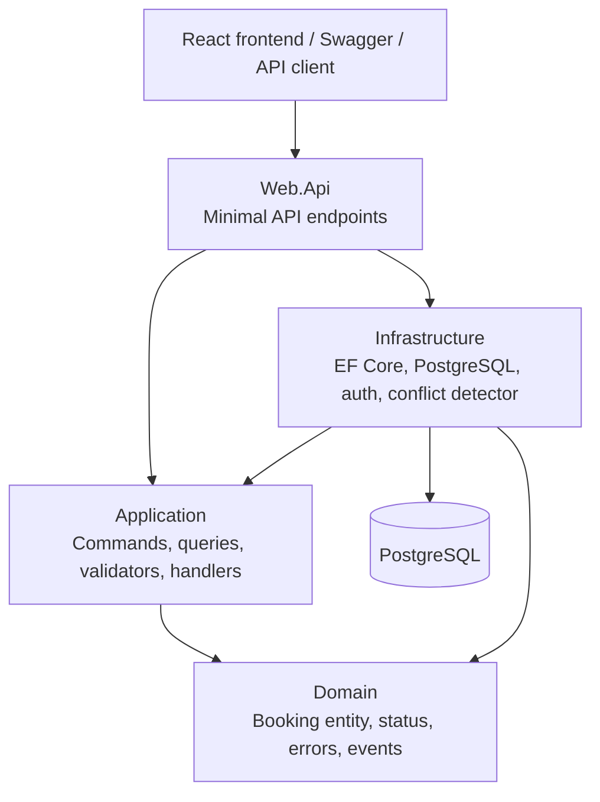
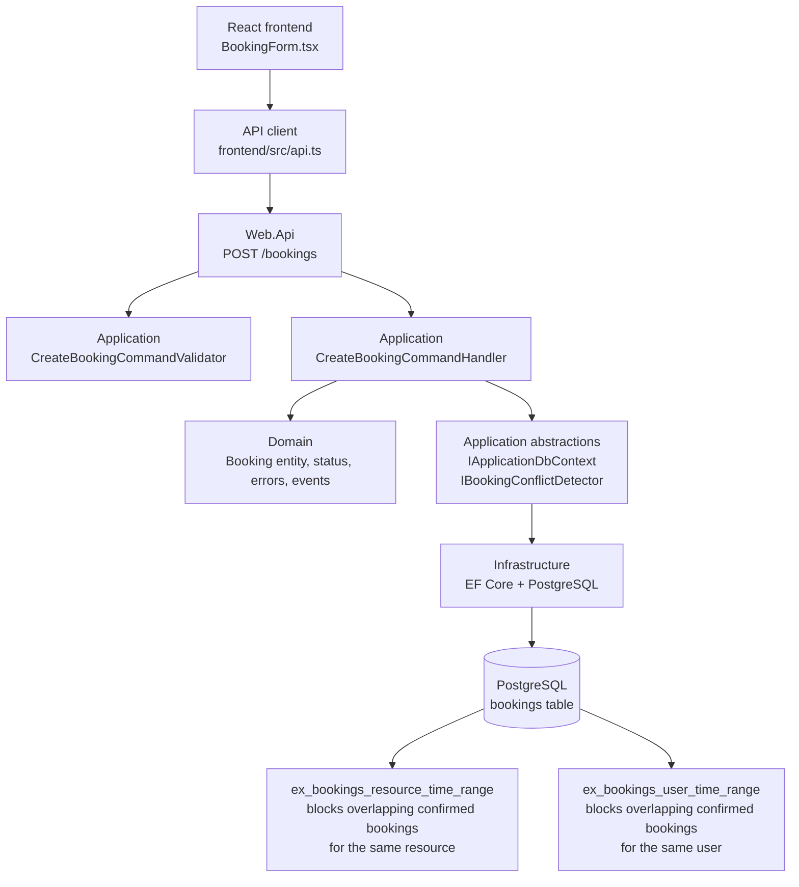
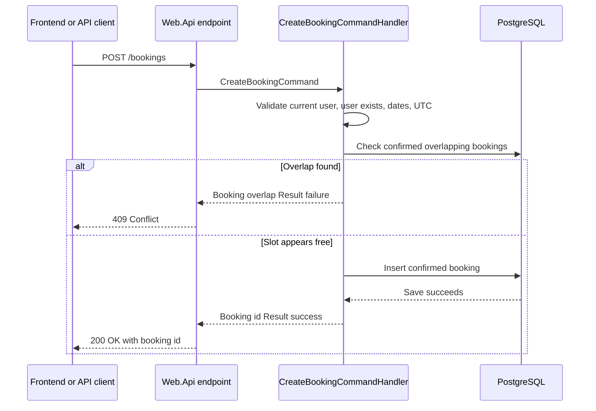
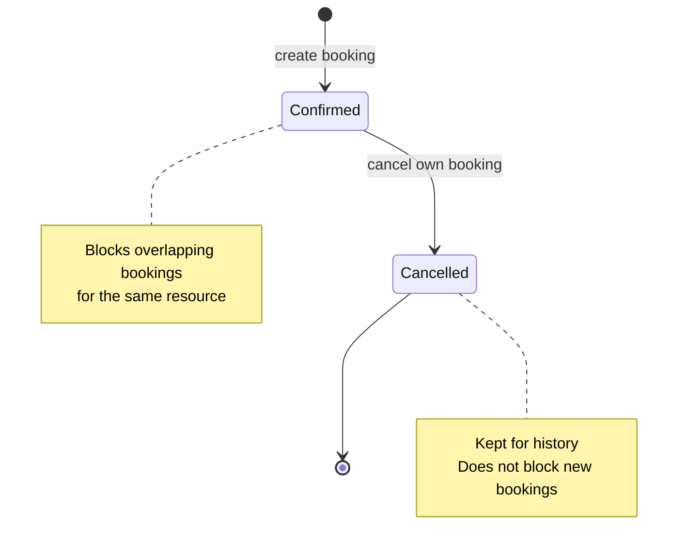
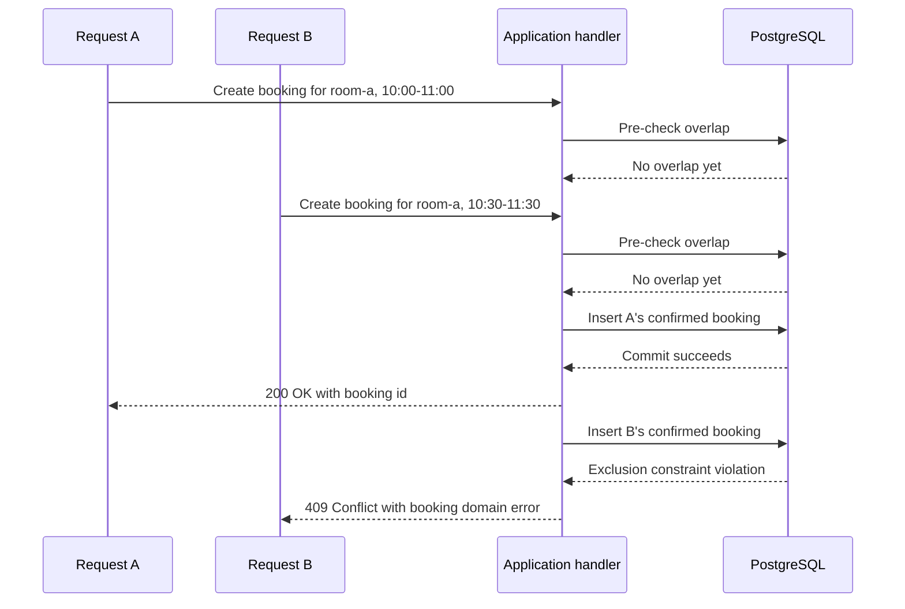

# Bookify Booking Management Service

Bookify is a .NET 10 Web API built with a pragmatic Clean Architecture style. This implementation adds a Booking Management Service for shared resources, plus a small Vite React frontend that exercises the API end to end.

## Running Locally

Start PostgreSQL and Seq:

```powershell
docker compose up -d postgres seq
```

Run the API:

```powershell
dotnet run --project src/Web.Api/Web.Api.csproj --launch-profile http
```

Open Swagger:

```text
http://localhost:5000/swagger
```

Run the frontend:

```powershell
cd frontend
npm install
npm run dev
```

The frontend uses `VITE_API_BASE_URL` and defaults to `http://localhost:5000`.

## API Summary

Authentication uses the existing JWT flow:

- `POST users/register`
- `POST users/login`
- `POST users/id`

Booking endpoints require a bearer token:

- `POST /bookings`
  - Body: `{ resourceId, userId, startDateTime, endDateTime }`
  - Returns the booking id.
- `GET /bookings?resourceId=room-a&fromDateTime=...&toDateTime=...&page=1&pageSize=50&includeCancelled=false`
  - Returns `{ items, page, pageSize, totalCount }`.
- `GET /bookings/me?fromDateTime=...&toDateTime=...&page=1&pageSize=50&includeCancelled=false`
  - Returns the authenticated user's bookings.
- `PUT /bookings/{bookingId}/cancel`
  - Soft-cancels the booking.

Dates may be sent as ISO-8601 values with `Z` or an offset. The API normalizes them to UTC before persistence.

## Current Architecture

Bookify follows a pragmatic Clean Architecture structure. The main idea is that business rules stay near the center of the solution, while delivery and infrastructure details stay at the edges.

- `src/Domain` contains the core business concepts. For bookings, this includes the `Booking` entity, `BookingStatus`, booking domain errors, and booking domain events.
- `src/Application` contains use cases. Booking creation, cancellation, and read flows are implemented as CQRS commands and queries with handlers. This layer depends on abstractions such as `IApplicationDbContext`, `IUserContext`, `IDateTimeProvider`, and `IBookingConflictDetector`.
- `src/Infrastructure` implements technical details. It provides EF Core/PostgreSQL persistence, entity configuration, migrations, authentication services, and the PostgreSQL-specific booking conflict detector.
- `src/Web.Api` exposes the use cases through Minimal API endpoints. Endpoints are intentionally thin: they receive HTTP input, create a command or query, call the handler, and convert the `Result` into an HTTP response.
- `frontend` is a small Vite React client that calls the API and demonstrates the booking workflow end to end.

The dependency direction is inward. Web.Api and Infrastructure can depend on Application, Application can depend on Domain, but Domain does not depend on the outer layers. This keeps the booking business logic testable and prevents HTTP or database details from leaking into the core model.



### Booking Architecture View

This view shows how a resource booking request moves through the application and where each layer takes responsibility.



## Booking Business Logic

Bookings are modeled as a domain feature beside Users. A booking has a `ResourceId`, `UserId`, UTC `StartDateTime`, UTC `EndDateTime`, `Status`, and audit timestamps for creation/cancellation. Cancellation is a soft delete: cancelled rows remain queryable when requested, but they no longer block future bookings.

The create-booking flow is:

1. The authenticated user must match the `UserId` in the request.
2. The target user must exist.
3. The resource id is trimmed, and all date-times are normalized to UTC.
4. The requested end time must be after the start time.
5. The requested time window must not overlap an existing confirmed booking for the same resource.
6. A confirmed booking is saved and a `BookingCreatedDomainEvent` is raised.



Overlap is defined with half-open intervals: `[StartDateTime, EndDateTime)`. Two confirmed bookings overlap when:

```text
existing.StartDateTime < requested.EndDateTime
AND requested.StartDateTime < existing.EndDateTime
```

This means a booking that ends exactly when another begins is allowed. It is a common scheduling convention because it avoids artificial gaps between adjacent reservations.

The read flows use the same overlap rule to find bookings within a requested date range. `GET /bookings` returns bookings for a resource, while `GET /bookings/me` returns bookings owned by the authenticated user. Both endpoints support paging and can optionally include cancelled bookings.

The cancel flow only allows a user to cancel their own booking. It marks the booking as `Cancelled`, sets `CancelledAt`, raises a `BookingCancelledDomainEvent`, and keeps the row in the database for history.



## Error Handling

Handlers return `Result` or `Result<T>` instead of throwing exceptions for expected business failures. For example:

- invalid or unauthorized user access returns a user domain error;
- an overlapping booking returns `Bookings.OverlapsExistingBooking`;
- cancelling a missing booking returns `Bookings.NotFound`;
- cancelling an already cancelled booking returns `Bookings.AlreadyCancelled`.

Web.Api converts these results into consistent HTTP responses through `CustomResults.Problem`.

## Extension: Concurrency

I chose Option 1, Concurrency, because preventing double-booking is the most important correctness requirement in a booking system.

The race condition is:

1. Request A checks that the slot is free.
2. Request B checks the same slot before A commits.
3. Both requests think the slot is available.
4. Without a stronger guard, both could insert confirmed bookings for the same resource and overlapping time window.



The application handler includes a friendly pre-check:

```text
existing.StartDateTime < requested.EndDateTime
AND requested.StartDateTime < existing.EndDateTime
```

This gives normal users a clear `409 Conflict` response before trying to insert. However, that check is not enough by itself because two requests can pass it at the same time.

The final guard is in PostgreSQL. The booking migration creates the `btree_gist` extension and adds an exclusion constraint:

```sql
ALTER TABLE public.bookings
ADD CONSTRAINT ex_bookings_resource_time_range
EXCLUDE USING gist (
    resource_id WITH =,
    tstzrange(start_date_time, end_date_time, '[)') WITH &&
)
WHERE (status = 'Confirmed');
```

This tells PostgreSQL: for confirmed bookings, the same resource cannot have overlapping time ranges. If two concurrent requests race, one insert can commit and the other is rejected by the database. Infrastructure detects that specific PostgreSQL exclusion-violation error through `PostgresBookingConflictDetector`, and the application maps it back to the same `Bookings.OverlapsExistingBooking` domain error.

### Tradeoffs

This approach prioritizes correctness and keeps the application logic simple. The database is the single authority on whether overlapping confirmed bookings can exist, so the system stays safe even under high concurrency or multiple API instances.

The main tradeoff is PostgreSQL specificity. Exclusion constraints and `tstzrange` are PostgreSQL features, so a different database would need another strategy, such as serializable transactions, explicit locks, optimistic concurrency with retry logic, or an equivalent range constraint. The constraint can also create contention on very busy resources, but that contention is acceptable here because it protects the core invariant: one resource cannot be confirmed for two overlapping bookings.

## Scale And Evolution

The first bottleneck would likely be hot resources with many bookings in the same date ranges. The current indexes support resource/date-range reads, but a heavily booked resource can still create contention around the exclusion constraint.

To evolve this into a distributed system, bookings should be owned by a booking service with resource-based partitioning, idempotency keys for create requests, and an outbox/event stream for downstream consumers. Query-heavy views could move to read models optimized for calendar display or availability search.

The implementation prioritizes correctness first, then simplicity. Performance is kept reasonable through indexes and bounded paging, but the design avoids premature caching or distributed coordination.

## Tests

Run backend checks:

```powershell
dotnet build src/Web.Api/Web.Api.csproj
dotnet test tests/Application.UnitTests/Application.UnitTests.csproj
dotnet test tests/IntegrationTests/IntegrationTests.csproj
```

Run frontend build:

```powershell
cd frontend
npm install
npm run build
```

Integration tests use Testcontainers PostgreSQL, so Docker must be running.
